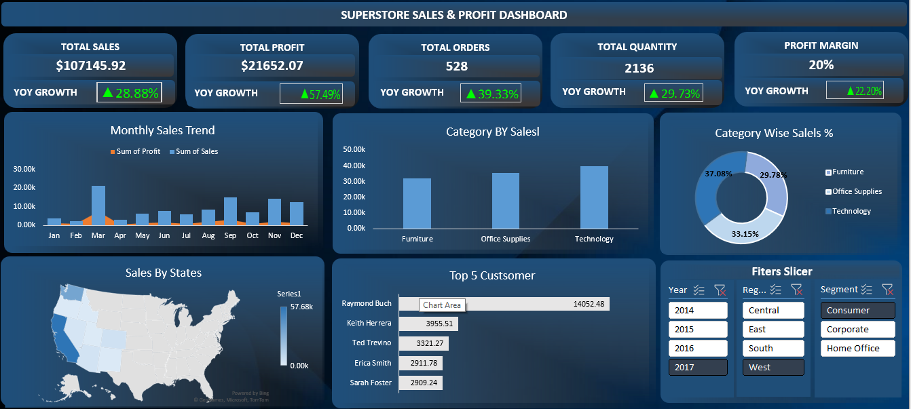

# Superstore Sales & Profit Dashboard

An interactive Sales & Profit Dashboard built entirely in Microsoft Excel using the Superstore dataset.

## 🎯 Project Objective

The objective of this project was to build an interactive Excel dashboard to analyze sales, profit, orders, quantity, profit margin, and customer performance.

The dashboard allows users to explore the data dynamically using slicers and visualizations.

## 🛠️ Tools & Techniques

- Microsoft Excel
- PivotTables
- PivotCharts
- Slicers
- Excel formulas
- Data aggregation
- Data visualization
- Conditional formatting
- Interactive dashboard design

## 📈 Dashboard Features

- Total Sales
- Total Profit
- Total Orders
- Total Quantity
- Profit Margin
- Year-over-Year (YoY) Growth
- Monthly Sales & Profit Trend
- Category-wise Sales
- Category-wise Sales Percentage
- Sales by State
- Top 5 Customers
- Interactive filters for:
  - Year
  - Region
  - Segment
 
  - ## 📊 Dashboard Preview

## 📂 Files Included

- `Superstore-Sales-Profit-Dashboard.xlsx` — Interactive Excel dashboard
- `Sample - Superstore.csv` — Dataset used for analysis
- `dashboard-preview.png` — Dashboard preview image

## 💡 Key Learning

This project helped me practice building an interactive business dashboard in Excel and understand how PivotTables, PivotCharts, formulas, and slicers can be combined to turn raw data into meaningful insights.

## 👤 Author

**Mohd Amaan**

GitHub: [MohdAmaan-dataAnalytics](https://github.com/MohdAmaan-dataAnalytics)
